# Pair Programming
## Connection - Pros and Cons (10')
- In solo, list all the pros and cons of `Pair Programming`
- Share with the rest of the group

## Concepts - What really is `Pair Programming` (20')
[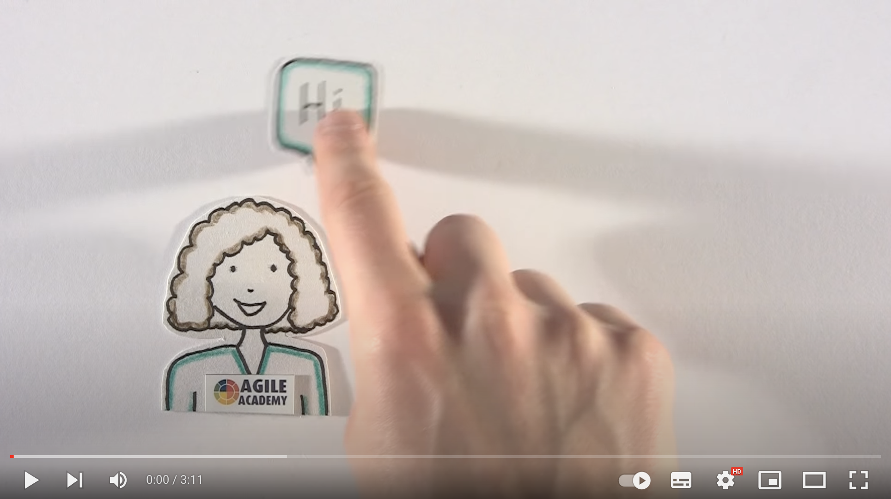](https://youtu.be/ET3Q6zNK3Io)

- What did you see?
- What do you think about it?
- What are the 2 roles explained?

  

  Pros and cons
  

  
| Pros                                           | Cons                 |
|------------------------------------------------|----------------------|
| Instantly shared best practices / knowledge    | Tiring               |
| Improved design / code quality                 | Can create frictions |
| Fewer mistakes                                 |                      |
| Faster on-boarding                             |                      |
| Increase moral / confidence                    |                      |
| Increase team cohesion / collective ownership  |                      |
| Instant code reviews (shortest feedback loops) |                      |

### What it is not
Not 1 person sleeping and another one working

### When pairing helps
- Better efficiency
- Improve technical skills
- Aid transfer knowledge
- Improve communication
- Enhance problem-solving capabilities
- Simplify the existing code base

### Different styles
The Different Styles of Pair Programming (more details [here](https://www.drovio.com/blog/the-different-styles-of-pair-programming/))

#### Driver-Navigator
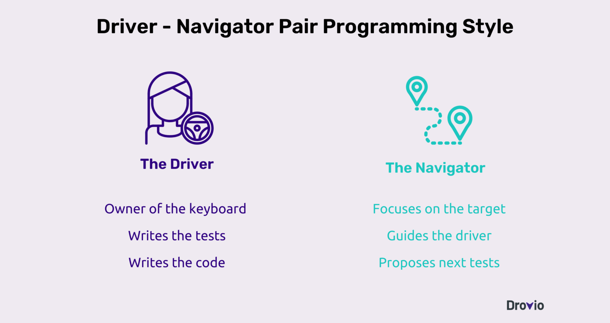

> When do we change the roles?

#### Strong Style
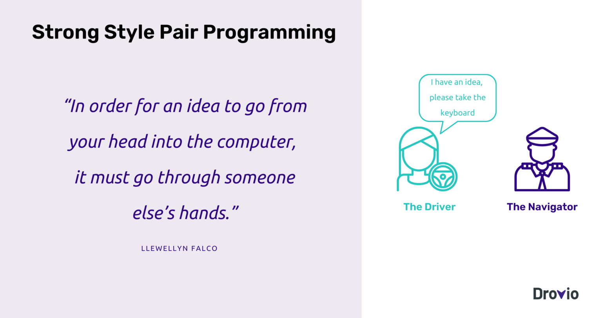

#### Ping-Pong
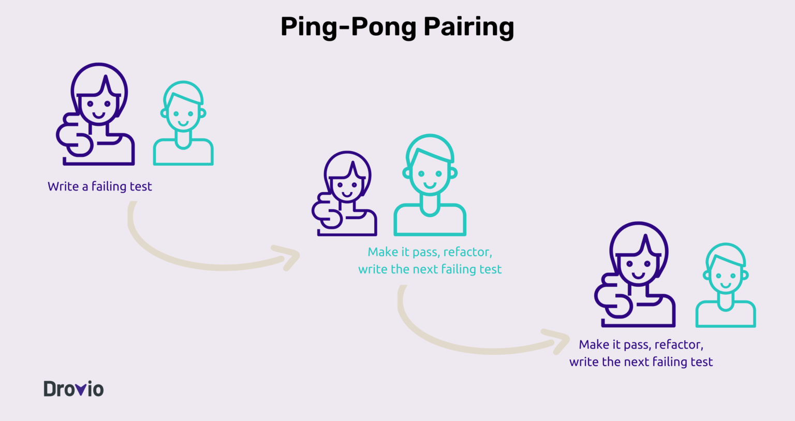

#### Unstructured
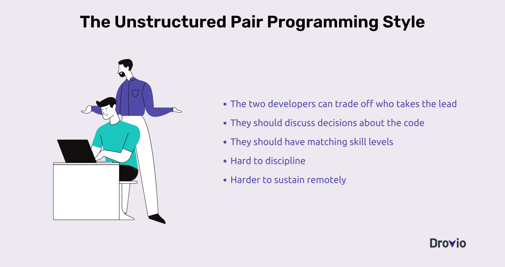

#### Backseat Navigator
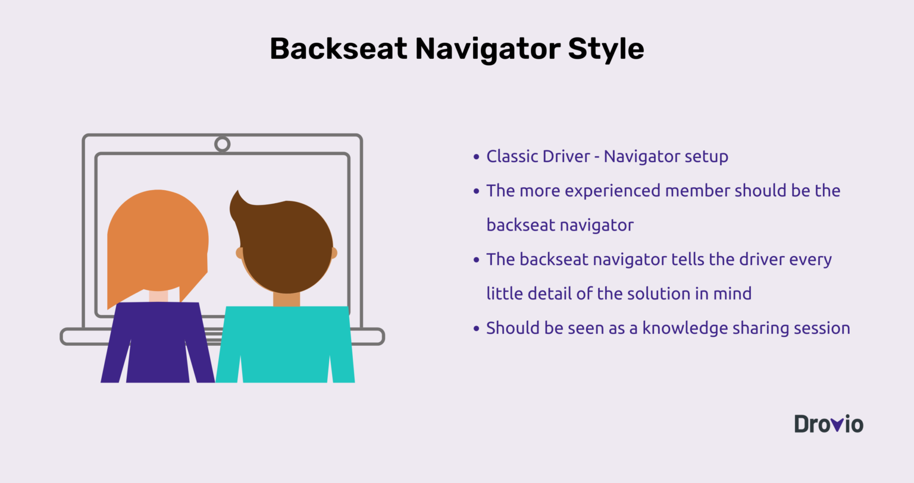

#### Tour Guide
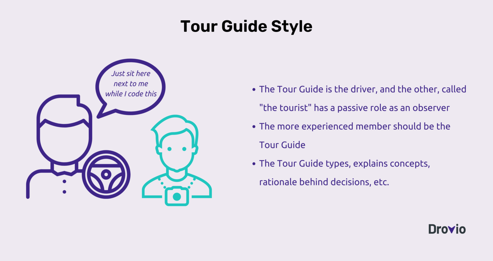

> To start pairing, use a timer.

### What about its cost?
[The Costs and Benefits of Pair Programming Alistair Cockburn & Laurie Williams](https://www.researchgate.net/publication/2333697_The_Costs_and_Benefits_of_Pair_Programming)
- The development cost is approximately `15% higher`

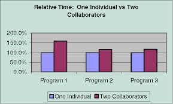

> BUT repaid in :

- Shorter and less expensive testing
- Higher quality assurance

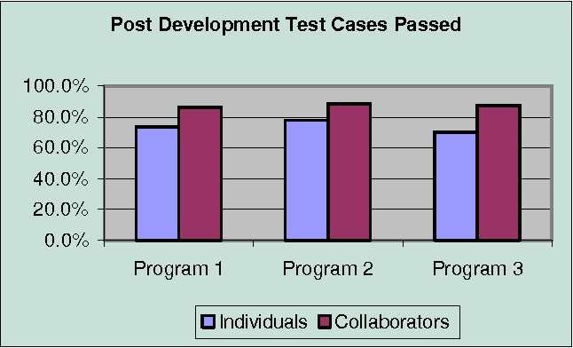

- Less complex code / better code quality
- Less field support

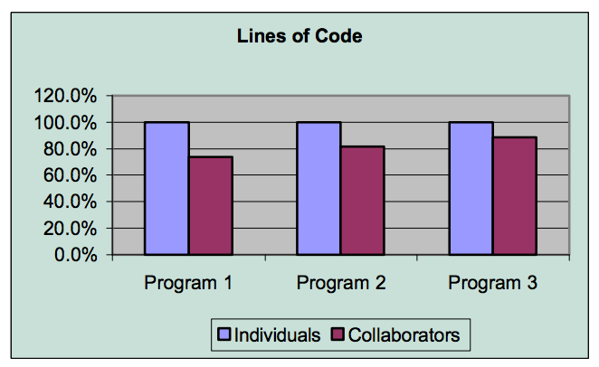

#### Best Practices
- Take notes
  - Decision points
  - Pros / cons
- Build confidence: 
  - `Commit` often
  - Write quality unit tests
- Communicate – without violence
  - To propose an idea : “I think...”
  - To confirm agreement : “Do we agree...”
  - To discuss progress towards goals : “We agree...”
  - Avoid saying “No” / ”But”
    - Instead try saying, “Yes and...”
  - Ask “What would it take to get you in...” if you disagree about a proposed idea 
- Reflect
  - At the end of the session
  - Small retro : what did we learn, what can be improved, ...
- Empty your cup
  - Like in martial arts, empty your head
  - Be ready to learn
  - Be humble

### Concrete Practice - Yatzy (1h15)
- Find a pair
  - Discover together the code and the associated rules of the `Yatzy` [here](yatzy/YATZY.md)
  - Select a programming language
- Make 2 iterations of 40 minutes
  - 35 minutes coding
  - 5 minutes of reflect
  - Change of pair

#### Reflect -> Faire 1 carte
- What did we learn together?
- How could be more efficient next time?
- What else?

### Conclusion -> faire 1 quadrant
- What did you do faster than usual in pair?
- What did you do slower than usual in pair?
- What did you learn in your pair?

#### How to start?
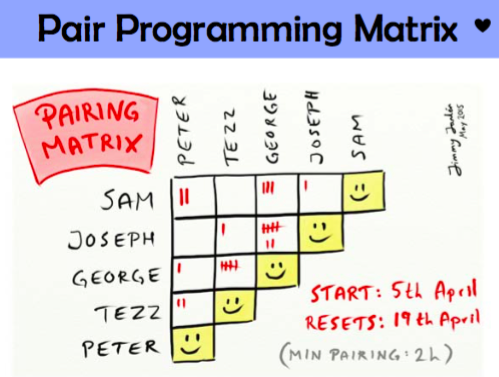

> Pairing help you identify your blindspots
